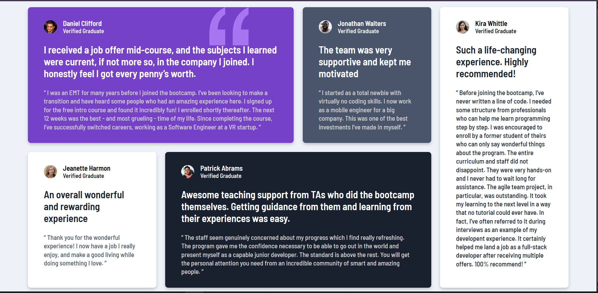

# Testimonial Grid Section

This is a solution to the [Testimonial Grid Section challenge on Frontend Mentor](https://www.frontendmentor.io/solutions/testimonial-grid-section-bnFVu3qfGp). The goal was to build a responsive testimonial layout that matches the design as closely as possible.

## 🚀 Overview

### The challenge

Users should be able to:

- View the optimal layout for the app depending on their device's screen size
- See hover states for interactive elements (if any)

### Screenshot

### Links

- Solution URL: [Frontend Mentor Submission](https://www.frontendmentor.io/solutions/testimonial-grid-section-bnFVu3qfGp)
- Live Site URL: [Live Demo](https://testimonial-grid-section-delta-cyan.vercel.app/)

## 🔧 My Process

### Built with

- Semantic HTML5 markup
- CSS Grid
- Flexbox
- Mobile-first workflow

### What I learned

> This project helped me improve my use of CSS Grid for creating responsive layouts. I also refined my understanding of how to control spacing and typography more precisely.

### Continued development

I plan to improve the subtle 3D feel by adjusting the `box-shadow` values to better match the original design spec.

## 🧠 Author

- GitHub - [@neouruguayancr](https://github.com/neouruguayancr)
- Frontend Mentor - [@neouruguayancr](https://www.frontendmentor.io/profile/neouruguayancr)